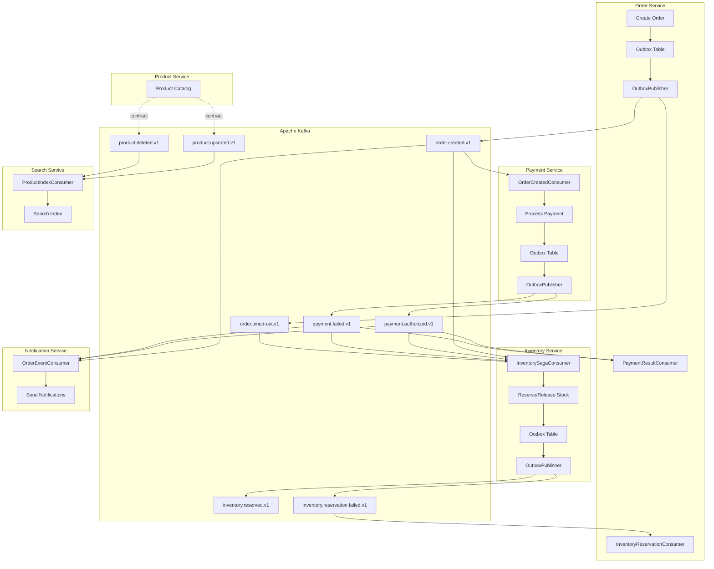

# Event-Driven Architecture (EDA) in Ecom Backend

Last updated: 2025-02-21

## Overview

The backend uses an **event-driven architecture** with **Apache Kafka** as the message broker. Services communicate asynchronously via domain events, enabling loose coupling, scalability, and resilience.

---

## Core Components

### 1. **Domain Event Structure**

All events follow a common envelope defined by `DomainEvent<T>`:

```
DomainEvent<T>
├── eventId      (UUID) – idempotency / deduplication
├── eventType    (string) – e.g. "order.created.v1"
├── occurredAt   (Instant)
├── producer     (string) – e.g. "order-service"
├── schemaVersion (string) – "v1"
├── traceId      (string) – distributed tracing
└── payload      (T) – typed event-specific data
```

### 2. **Outbox Pattern (Transactional Outbox)**

Publishers do **not** send to Kafka directly. Instead:

1. **Enqueue**: Business logic writes an event to an `OutboxEventRecord` table in the **same transaction** as the domain change.
2. **Poll & Publish**: A scheduled `OutboxPublisher` polls `PENDING` records and sends them to Kafka.
3. **Retry**: Failed sends are retried; after max attempts they move to `FAILED` and can be replayed manually.

This guarantees **at-least-once delivery** and avoids dual-write failures.

### 3. **Consumer Deduplication**

Consumers store `eventId` in `ConsumedEventRecord` before processing. If the same event is delivered again (Kafka at-least-once), it is skipped, ensuring **idempotent handling**.

---

## Event Flow Architecture

```
┌─────────────────────────────────────────────────────────────────────────────────────────┐
│                              KAFKA BROKER (Topics)                                       │
│  order.created.v1 │ payment.authorized.v1 │ payment.failed.v1 │ order.timed-out.v1       │
│  inventory.reserved.v1 │ inventory.reservation.failed.v1 │ product.upserted.v1 │ ...     │
└─────────────────────────────────────────────────────────────────────────────────────────┘
         ▲                    ▲                    ▲                    ▲
         │                    │                    │                    │
    ┌────┴────┐          ┌────┴────┐          ┌────┴────┐          ┌────┴────┐
    │ Outbox  │          │ Outbox  │          │ Outbox  │          │ Outbox  │
    │ Publisher│          │ Publisher│          │ Publisher│          │ Publisher│
    └────┬────┘          └────┬────┘          └────┬────┘          └────┬────┘
         │                    │                    │                    │
┌────────┴────────────────────┴────────────────────┴────────────────────┴────────────────┐
│                                    SERVICES                                            │
│  Order Service  │  Payment Service  │  Inventory Service  │  Product Service  │  ...    │
│  (Outbox + DB)  │  (Outbox + DB)    │  (Outbox + DB)      │  (Outbox + DB)    │         │
└────────────────────────────────────────────────────────────────────────────────────────┘
         │                    │                    │                    │
         │              @KafkaListener         @KafkaListener         @KafkaListener
         ▼                    ▼                    ▼                    ▼
┌────────────────────────────────────────────────────────────────────────────────────────┐
│                           CONSUMERS (by service)                                        │
│  PaymentResultConsumer  │  InventorySagaConsumer  │  OrderEventConsumer  │  ...         │
│  InventoryReservationConsumer  │  ProductIndexConsumer  │  (ConsumedEventRecord dedup)  │
└────────────────────────────────────────────────────────────────────────────────────────┘
```

---

## Event Contracts (Producer → Consumers)

| Event | Producer | Consumers |
|-------|----------|-----------|
| `order.created.v1` | Order Service | Payment, Inventory, Notification |
| `order.timed-out.v1` | Order Service | Inventory |
| `payment.authorized.v1` | Payment Service | Order, Inventory, Notification |
| `payment.failed.v1` | Payment Service | Order, Inventory, Notification |
| `inventory.reserved.v1` | Inventory Service | (none) |
| `inventory.reservation.failed.v1` | Inventory Service | Order |
| `product.upserted.v1` | Product Service | Search |
| `product.deleted.v1` | Product Service | Search |
| `notification.alert.v1` | Notification Service | (ops) |
| `notification.dlq.v1` | Notification Service | (ops) |

---

## Order Saga Flow (Main Use Case)

The order lifecycle is orchestrated via events (choreography, not central orchestrator):

```
                    ┌──────────────────┐
                    │  Order Service   │
                    │  Create Order    │
                    └────────┬─────────┘
                             │
                             │ order.created.v1 (via Outbox)
                             ▼
        ┌────────────────────┼────────────────────┐
        │                    │                    │
        ▼                    ▼                    ▼
┌───────────────┐   ┌───────────────┐   ┌───────────────┐
│   Payment     │   │   Inventory   │   │  Notification │
│   Service     │   │   Service     │   │   Service     │
│ reserve $     │   │ reserve stock │   │ send email    │
└───────┬───────┘   └───────┬───────┘   └───────────────┘
        │                   │
        │ payment.authorized / payment.failed
        ▼                   │
┌───────────────┐           │
│ Order Service │◄──────────┘
│ update status │   inventory.reservation.failed (if reserve fails)
└───────────────┘
        │
        │ order.timed-out.v1 (scheduler, if payment times out)
        ▼
┌───────────────┐
│   Inventory   │
│ release stock │
└───────────────┘
```

**Flow in words:**

1. **Order created** → `order.created.v1` published.
2. **Payment** consumes → charges card → publishes `payment.authorized.v1` or `payment.failed.v1`.
3. **Inventory** consumes `order.created` → reserves stock → publishes `inventory.reserved.v1` or `inventory.reservation.failed.v1`.
4. **Inventory** consumes `payment.authorized` → confirms reservation; consumes `payment.failed` or `order.timed-out` → releases reservation.
5. **Order** consumes `payment.authorized`/`payment.failed` → updates status; consumes `inventory.reservation.failed` → marks order as failed.
6. **Notification** consumes order/payment events → sends emails or alerts.

---

## Product → Search Flow

```
Product Service                    Search Service
      │                                  │
      │ product.upserted.v1              │
      │ product.deleted.v1               │
      └─────────────────────────────────►  ProductIndexConsumer
                                          │
                                          ▼
                                    update / remove
                                    from search index
```

---

## Reliability Mechanisms

| Mechanism | Purpose |
|-----------|--------|
| **Transactional Outbox** | Ensure events are published only after DB commit; avoid lost events |
| **ConsumedEventRecord** | Idempotent consumption; skip duplicate deliveries |
| **Outbox retry + FAILED** | Handle transient Kafka errors; manual replay for persistent failures |
| **Dead Letter Queue (DLQ)** | Capture notification failures for inspection / replay |
| **Event contracts (JSON Schema)** | Validate payloads; `check_event_contracts.py` for CI |

---

## Kafka Topics (typical naming)

- `order.created.v1`
- `order.timed-out.v1`
- `payment.authorized.v1`
- `payment.failed.v1`
- `inventory.reserved.v1`
- `inventory.reservation.failed.v1`
- `product.upserted.v1`
- `product.deleted.v1`
- `notification.alert.v1`
- `notification.dlq.v1`

Topic names are configurable via `app.kafka.topics.*` in `application.yml` per service.

---

## Diagram (Mermaid)



---

## References

- Event contracts: `ecom-back/contracts/events/`
- Domain event model: `common/common-events/src/main/java/com/ecom/common/DomainEvent.java`
- Outbox support: `common/common-core/src/main/java/com/ecom/common/reliability/OutboxPublishSupport.java`
- Contract validation: `ecom-back/scripts/check_event_contracts.py`
